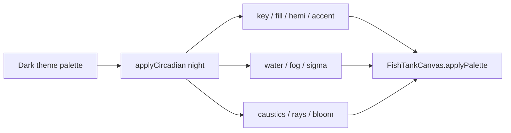

# Colorful night reef (CatPortfolio fish tank)

## Goal

Make the **dark / night** 3D tank read like an undersea game (Abzû / Subnautica-shallow / Dave the Diver): saturated teal water, cyan moonlight shafts, neon flora, visible fish. Keep it a **night** scene (stars, slower fauna, cooler key) — not a second daylight lagoon.

Light themes (Latte / Paper) stay a sunlit lagoon. Circadian night on those themes already no-ops; that stays.

## Why it looks muddy today

Two stacked darkeners, then fog finishes the job.

1. **Dark-theme base** (`resolveTankThemePalette`) is already a “night dive”: dim hemi, thick fog (`0.019`), weed mixed toward near-black `deep`.
2. **Circadian night** (`applyCircadian`) then mixes water / fog / ambient toward `0x040a1a`, drops key to **22%**, ambient to **45%**, hemi to **40%**, and *cuts* caustics and god-rays.
3. **Beer-Lambert fog** (`absorption.ts`) plus denser `sigma` turns remaining chroma into ink as you dive. `fogColor` is that same abyss, so distant geometry goes black instead of teal.
4. **Bloom** is a single conservative pass (`strength 0.42`, `threshold 0.72`) — bioluminescence never blooms.
5. **Plant / minnow glow** does not ramp with night: seaweed emissive is `0.18`, minnows tint toward `palette.deep`.

High-tier desktop is GLB reef + GLB heroes, so lighting / fog / caustics / bloom matter more than procedural plant meshes.

## Approach

Retune existing palettes and night knobs. No new systems, no scene remount, no domain-tinted fish lights (atlas albedo + white bloom lift stays).

### 1. Dark-theme base — colourful column even before the moon chip

In `src/blocks/fishTankTokens.ts`:

- Lift water / deep off ink: `WATER_BASE_DARK` `0x0a2b3d` → `0x0e3d58`, `DEEP_BASE_DARK` `0x02121d` → `0x072a40`.
- More cyan in ambient / fill / hemi; hemi ground gets a neon bounce (reef floor, not black sand).
- Thinner fog (`0.019` → `0.014`) and teal `fogColor` so dive haze stays blue-green.
- Stronger dark caustics / rays (`0.38`/`0.05` → `0.50`/`0.08`).
- Weed mixed toward water/neon, not `deep`.

Daylight (light theme) numbers stay as they are.

### 2. Circadian night — bioluminescent reef, not an abyss crush

In `src/blocks/fishTankCircadian.ts`:

- Mix toward saturated midnight teal (`0x0a3d62`), **not** `0x040a1a`.
- Water / fog / motes / bubbles pull **toward cyan**; weed toward neon.
- Moonlight key: still dimmer than day (`×0.55`), colour = mix of `sun` + `cyan`. Do **not** drop to `×0.22`.
- Fill **up** (`×1.15`); keep caustics / rays (`×1.2` / `×1.25`) — moonlight shafts are the game read.
- Absorption: red still dies first; green/blue travel further (`sigma` `[×1.08, ×0.92, ×0.80]`) so the column stays teal at range.
- Slightly **thinner** fog (`×0.92`) so colour survives a full dive.
- Sky fields still untouched (theme-keyed). Light themes still skip this branch.

### 3. Night tuning — glow that bloom can catch

In `src/blocks/fishTankConfig.ts` `NIGHT_TANK_TUNING` (already used for every dark theme via `resolveFishTankTuning(palette.light)`):

- Bump accent fill, bed bounce, minnow / bubble / mote / wake, fish body+fin emissive floors.
- Add `plantGlowMul` (day `1`, night `~2`) so seaweed / coral / crystals actually emit.

`POST_CONFIG` gets a day/night bloom pair, e.g.:

| | strength | radius | threshold |
|---|---|---|---|
| day (current) | 0.42 | 0.35 | 0.72 |
| night | ~0.62 | ~0.48 | ~0.50 |

Optional night exposure `~1.12` (day stays `1.05`). Colour first; don’t wash ACES.

### 4. Wire it live in the canvas / composer

- `tankComposer.ts`: accept initial bloom settings; expose `setBloom({ strength, radius, threshold })`.
- `FishTankCanvas.tsx` `applyPalette` (already the in-place theme/circadian resample):
  - `composer.setBloom` from `palette.phase`
  - `renderer.toneMappingExposure` from phase
  - minnow `emissive` tint toward cyan at night (today it follows `deep` and goes black)
  - weed / coral / crystal `emissiveIntensity *= plantGlowMul`
  - collect crystal materials the same way coral already is, so they resample

High-tier GLB scenery still gets the win from lights + fog + caustics + bloom; procedural plant glow is the low-tier extra.

## Tests

- `circadian.test.ts`
  - Keep: day is a no-op; light themes don’t darken; fauna slower; key dimmer than day; sky untouched; red dies faster than blue.
  - Replace “thickens water / cuts rays”: night water/fog stay **more chromatic** than a mix toward `0x040a1a`; `causticStrength` / `rayStrength` ≥ base; `fogDensity` not increased.
- `fishTankConfig.test.ts`: pin the new night tuning object (day pins unchanged).
- No new Playwright spec unless an existing tank visual assertion starts failing.

## Out of scope

- Light-theme lagoon look, sky-by-clock, domain-tinted fish lights, new particle systems, GLB texture edits.
- OpenCat Tunnel / WelTel docs.

## Verify

Unit tests above. Then open the tank on a **dark** theme:

1. Circadian **day** chip — teal column, visible fish, not a bright lagoon.
2. Circadian **night** chip — slower fauna, cyan shafts, glowing flora, not ink.
3. Full dive — distant reef goes teal-blue, not black.
4. Paper / Latte — still a lagoon (regression).
5. Desktop + mobile viewports if the dev server is up.

## Already on disk (interrupted turn)

Palette + circadian files were edited before this plan. Remaining work is tuning, bloom, canvas wiring, and test rewrites. If those palette edits should be reverted and re-applied as one PR after approval, say so; otherwise continue from that diff.
